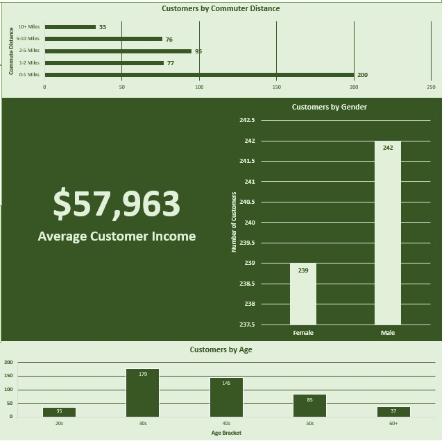
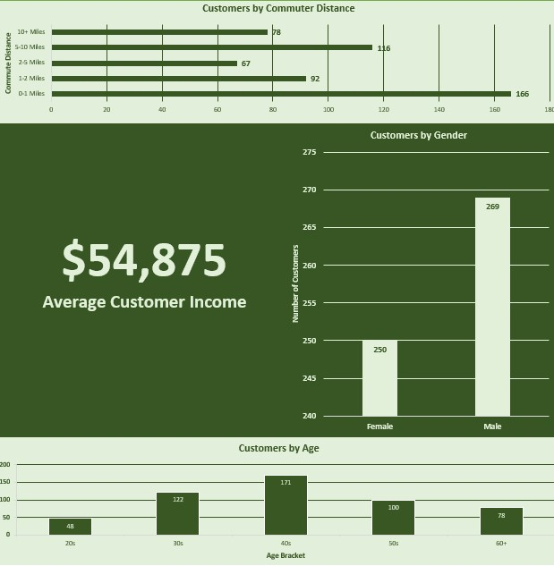

# Preston's Porfolio

## [Project 1--Bike Shop Customer Data](https://github.com/byupresto/PortfolioProjects/blob/f096943f153868673d938ca4dd59a88f0966ea07/Bike%20Shop%20Customer%20Data%20Analysis.xlsx)
-This project analyzes the sales pattern of a bike shop across different customer demographics. The data used for this analysis set was provided by and used with the permission of Alex Freiburg @AlextheAnaylst on YouTube.

-The project demonstrates the ability to clean, analyze, and visualize data using Microsoft Excel.

### Customers That Purchased a Bike

### Customers That Did Not Purchase a Bike

